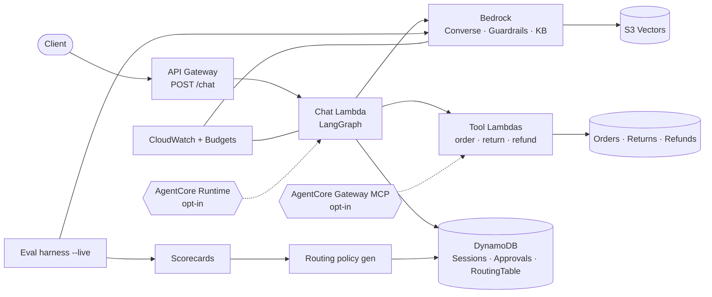
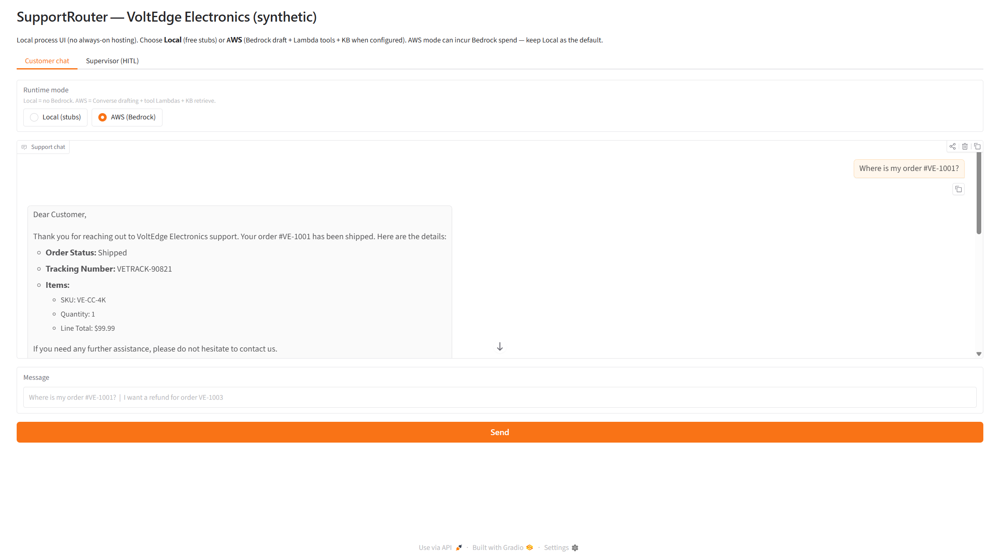
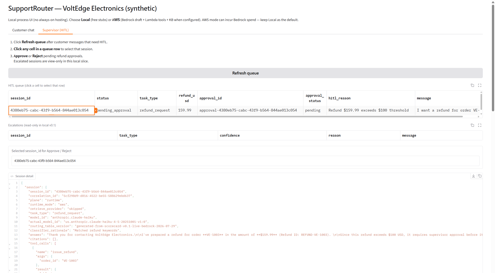

# SupportRouter

Eval-driven AI customer support agent for **VoltEdge Electronics** (fully
fictional DTC retailer), built on **AWS Bedrock + LangGraph**, delivered with a
**GitHub-first SDLC** (issues → ADRs → PRs → measured scorecards → releases).

**Audience:** hiring managers and reviewers who want proof of disciplined AI
engineering on AWS—not a toy chatbot README.

## Screenshots

**Architecture (AWS path):**



Full 4-diagram set (agent loop, eval→routing, AgentCore stretch):
[`ARCHITECTURE_AWS_DIAGRAM.md`](docs/01_architecture/ARCHITECTURE_AWS_DIAGRAM.md).

**Thin Gradio UI, driven live against the deployed AWS stacks** (`runtime_mode=aws`
— Bedrock Converse + tool Lambdas + Knowledge Base; small measured Bedrock cost,
not a scorecard artifact):

| Customer chat — order status | Supervisor — HITL refund approval |
|-------------------------------|-------------------------------------|
|  |  |
| Order-status question answered via Bedrock Converse + tool Lambda. | Refund over $100 auto-routes to `pending_approval`; supervisor sees full session/tool-call detail before approving. |

| Start here | Link |
|------------|------|
| **15–20 min demo** (AWS + AI engineering) | [`docs/00_project/DEMO_SCRIPT_AWS_AI.md`](docs/00_project/DEMO_SCRIPT_AWS_AI.md) |
| 5–10 min portfolio walkthrough | [`docs/00_project/PORTFOLIO_WALKTHROUGH.md`](docs/00_project/PORTFOLIO_WALKTHROUGH.md) |
| AWS architecture diagrams (AI + AWS) | [`docs/01_architecture/ARCHITECTURE_AWS_DIAGRAM.md`](docs/01_architecture/ARCHITECTURE_AWS_DIAGRAM.md) |
| Releases (v0.1 → v0.6) | [GitHub Releases](https://github.com/raghuram-chittibomma/supportrouter-aws/releases) |
| Agent operating rules | [`AGENTS.md`](AGENTS.md) |

## What it demonstrates

- **Routing to the lowest-viable model** per task type (DynamoDB `RoutingTable`,
  policy generated from scorecards).
- **RAG** over synthetic FAQ/policy via Bedrock Knowledge Bases + **S3 Vectors**
  (OpenSearch Serverless deliberately avoided).
- **Tool-calling agent** (order / return / refund Lambdas) with least-privilege
  IAM.
- **Safety + HITL:** Bedrock Guardrails, deterministic confidence, refunds
  above **$100** require supervisor approval.
- **Eval plane:** golden scenarios, live Bedrock candidates, LLM-as-judge,
  versioned scorecards; offline adopt + DynamoDB publish.
- **Ops:** CDK (Python), dormancy-safe defaults, teardown, CloudWatch, $20/mo
  budget tag.
- **Stretch:** opt-in Bedrock **AgentCore** Runtime + Gateway MCP (dual-run;
  quality/cost explicitly not measured).

Synthetic data only. No real customers, policies, or transcripts.

## Measured metrics only

Cite resolution rate, cost/conversation, caching savings, or eval pass rates
**only** from scorecard or release-note evidence.

| Claim | Value | Evidence |
|-------|-------|----------|
| Golden eval overall pass (3 models × `order_status` + `faq_policy`, capped) | `true` | [`scorecard-v0.1-live-bedrock-2026-07-29`](evals/scorecards/scorecard-v0.1-live-bedrock-2026-07-29.json) |
| That run’s Bedrock cost | ~$0.0102 | same scorecard (`cost.total_usd`) |
| Judge prompt-cache vs uncached-equivalent (2 Converse calls) | ~31.8% lower ($0.00713 vs $0.01045) | [`scorecard-v0.1-prompt-cache-2026-07-30`](evals/scorecards/scorecard-v0.1-prompt-cache-2026-07-30.json) |

**Explicitly not measured:** runtime chat drafting cost (local stub default),
AgentCore host quality/cost
([`scorecard-v0.6-agentcore-not-measured`](evals/scorecards/scorecard-v0.6-agentcore-not-measured.json)).
Full notes: [`docs/03_operations/RELEASE_NOTES.md`](docs/03_operations/RELEASE_NOTES.md).

## Quick start (local)

```bash
python -m venv .venv
.venv\Scripts\activate   # Windows
pip install -e ".[dev]"
pytest
python -m supportrouter.cli "Where is my order #VE-1001?"
```

### Thin demo UI (Gradio)

```bash
pip install -e ".[ui]"
python -m supportrouter.ui
# http://127.0.0.1:7860 — Customer chat | Supervisor (HITL)
```

Local process only — **no always-on AWS UI**. Cost: not measured.

## AWS (summary)

Default edge: **API Gateway → Chat Lambda (LangGraph)**. Deploy/teardown and
AgentCore opt-in flags are in
[`docs/03_operations/RUNBOOK.md`](docs/03_operations/RUNBOOK.md). Diagrams:
[`ARCHITECTURE_AWS_DIAGRAM.md`](docs/01_architecture/ARCHITECTURE_AWS_DIAGRAM.md).

## Delivery status

Shipped through **[v0.6.0](https://github.com/raghuram-chittibomma/supportrouter-aws/releases/tag/v0.6.0)**
(AgentCore stretch). Prior cumulative platform tag:
**[v0.5.0](https://github.com/raghuram-chittibomma/supportrouter-aws/releases/tag/v0.5.0)**.
Planned milestones v0.1–v0.6 are closed on GitHub; further work is portfolio /
ops polish unless new issues are filed.

## Docs map

| Doc | Why |
|-----|-----|
| [`docs/00_project/AI_ORCHESTRATOR_BRIEF.md`](docs/00_project/AI_ORCHESTRATOR_BRIEF.md) | Initiation intent |
| [`docs/00_project/DEMO_SCRIPT_AWS_AI.md`](docs/00_project/DEMO_SCRIPT_AWS_AI.md) | Timed AWS + AI eng demo talk track |
| [`docs/00_project/PRODUCT_BRIEF.md`](docs/00_project/PRODUCT_BRIEF.md) | Personas & workflows |
| [`docs/01_architecture/ARCHITECTURE.md`](docs/01_architecture/ARCHITECTURE.md) | Architecture narrative |
| [`docs/01_architecture/DECISIONS/`](docs/01_architecture/DECISIONS/) | ADRs (supersede, don’t rewrite) |
| [`docs/02_testing/EVAL_STRATEGY.md`](docs/02_testing/EVAL_STRATEGY.md) | Eval / scorecard rules |
| [`docs/03_operations/RUNBOOK.md`](docs/03_operations/RUNBOOK.md) | Deploy, evals, routing publish |

## Stack

AWS Bedrock (Converse, Guardrails, KB, prompt caching) · LangGraph (Python) ·
Lambda tools · DynamoDB · API Gateway · CloudWatch · CDK · optional AgentCore
Runtime/Gateway · pytest + GitHub Actions.

## License

MIT (portfolio / demo)
