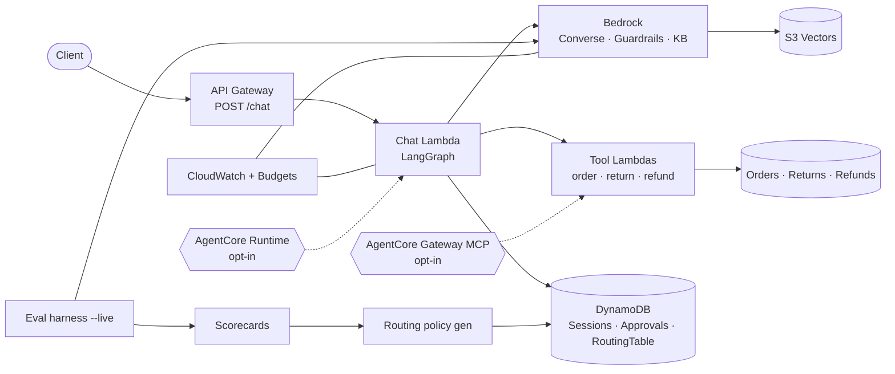
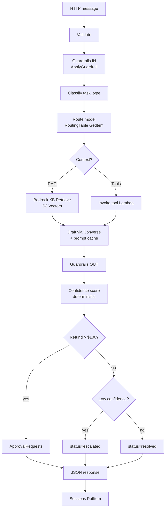
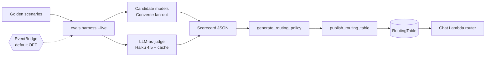
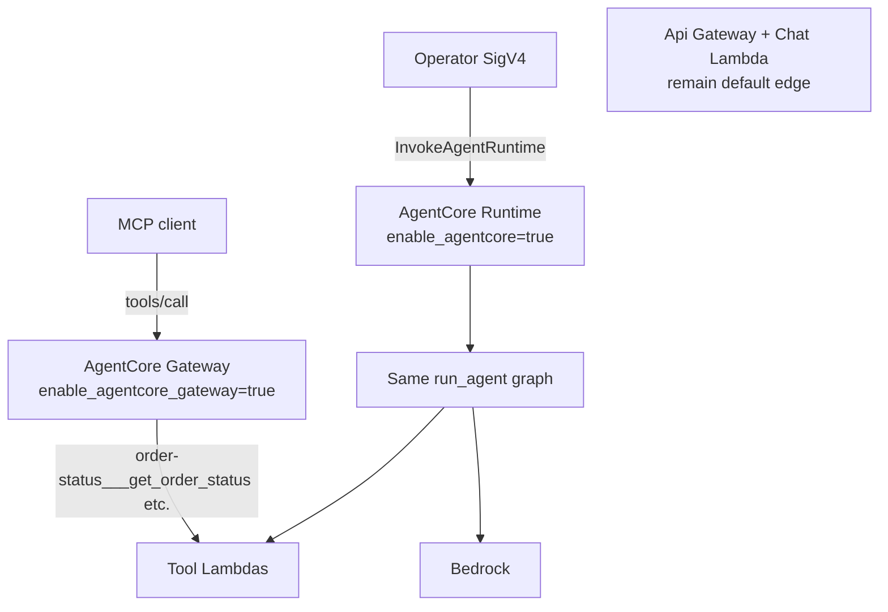

# SupportRouter — AWS architecture diagrams (AI + AWS)

AWS path only (`runtime_mode=aws`). Local stubs omitted. Open this file in the
editor/preview so each diagram can render at full width.

---

## 1. System overview

---

## 2. AI agent loop on Chat Lambda

---

## 3. Eval plane → routing table

---

## 4. Opt-in AgentCore stretch

---

## AI engineering map

| Concern | AWS / component |
|---------|-----------------|
| Classification | Classifier → `task_type` |
| Model routing | DynamoDB `RoutingTable` |
| RAG | Bedrock KB + S3 Vectors |
| Tool use | 3 Lambdas + tool DynamoDB |
| Drafting + cache | Bedrock Converse + `cachePoint` |
| Safety | Bedrock Guardrails |
| Confidence / HITL | Deterministic policy + Approvals table |
| Eval / judge | Live harness + Haiku judge |
| Policy update | Scorecard → generator → publish |
| Dual-run / MCP | AgentCore Runtime / Gateway (opt-in) |
| Ops | CloudWatch, Budgets, CDK |
